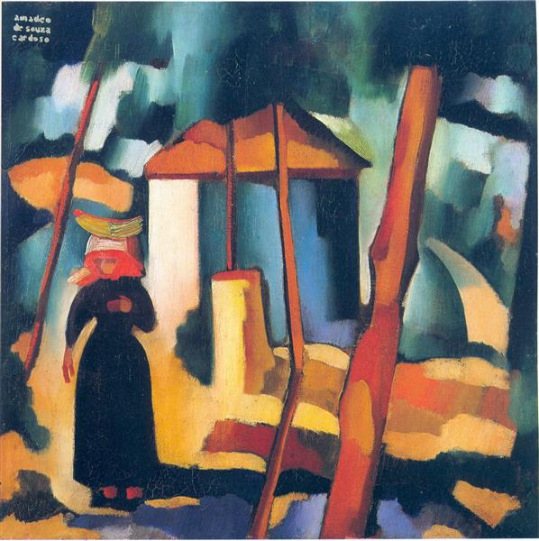
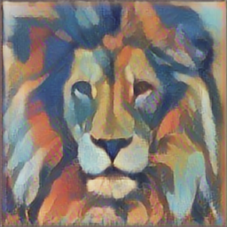

## __Neural Style Transfer__

This project utilizes neural style transfer techniques to transfer the style of a given content image into another image provided by the style given. The paper titled [A Neural Algorithm of Artistic Style](https://arxiv.org/abs/1508.06576) by Leon A. Gatys, Alexander S. Ecker, Matthias Bethge, (2015) has served as a fundamental reference for this project.

Website link: [https://melo04.github.io/Neural-style-transfer/](https://melo04.github.io/Neural-style-transfer/)

[Jupyter Notebook](https://github.com/Melo04/Neural-style-transfer/blob/main/notebook.ipynb)

## __What is Neural Style Transfer (NST)__

Neural Style Transfer (NST) is an optimization technique used to merge
two images—a content image and a style reference image and blend them together so the output image looks like the content image, but “painted” in the style of the style reference image. Below contains an example that maps the artistic style of [The Starry Night](https://en.wikipedia.org/wiki/The_Starry_Night) onto a night-time photograph of the tower nearby Stanford campus:

<div align="center">
 
 
 
</div>

## __Examples__
Applying the style of different images produce different interesting results. Here we renders a photograph to a variety of styles. Feel free to try it out in the website too.

<div align="center">


</div>

The following reproduce Figure 3 from the [paper](https://arxiv.org/abs/1508.06576), which renders a photograph of the Neckarfront in Tübingen, Germany in the style of 4 different iconic paintings [The Starry Night](https://www.wikiart.org/en/vincent-van-gogh/the-starry-night-1889), [Composition VII](https://www.wikiart.org/en/wassily-kandinsky/composition-vii-1913), [The Scream](https://www.wikiart.org/en/edvard-munch/the-scream-1893), [Corridor](https://www.wikiart.org/en/vincent-van-gogh/corridor-in-the-asylum-1889):

<div align="center">
 
</div>

<div align="center">


</div>

<div align="center">


</div>

<div align="center">


</div>

<div align="center">


</div>

## __Content/Style Tradeoff__
The relative weight of the style and content can be controlled.

Example below renders a lion photograph image with an increasing style weight applied to the style of [Amadeo Cardoso](https://en.citaliarestauro.com/amadeo-de-souza-cardoso-a-fabulous-painter/)

<div align="center">


</div>

<div align="center">



</div>

## __Compilation Instruction__
1. To run it locally, install [Yarn](https://classic.yarnpkg.com/en/) and run the command below in your terminal to get all the dependecies.
```bash
yarn run prep
```

2. Then, run this command below and go to ```localhost:9966``` to view the web application.
```bash
yarn run start
```